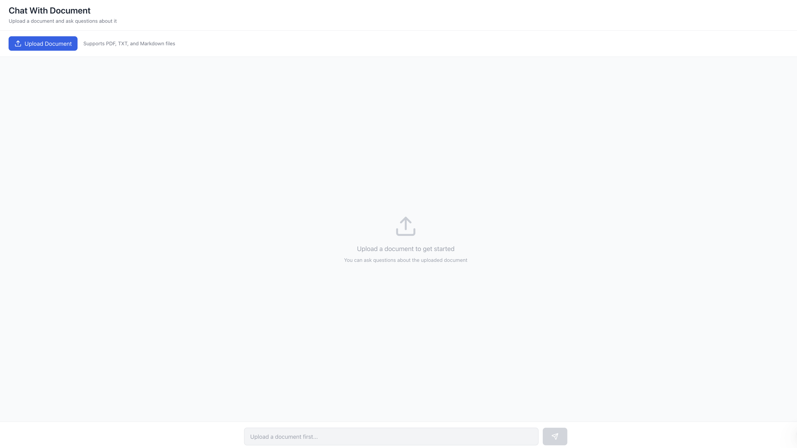
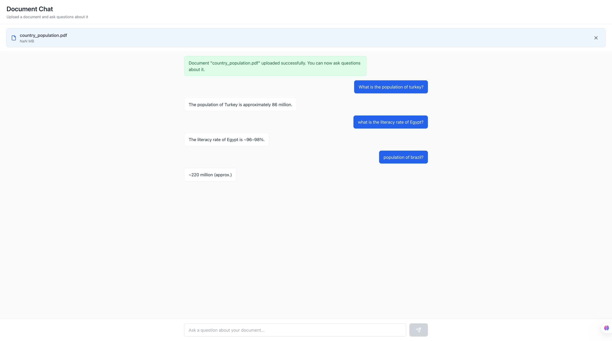
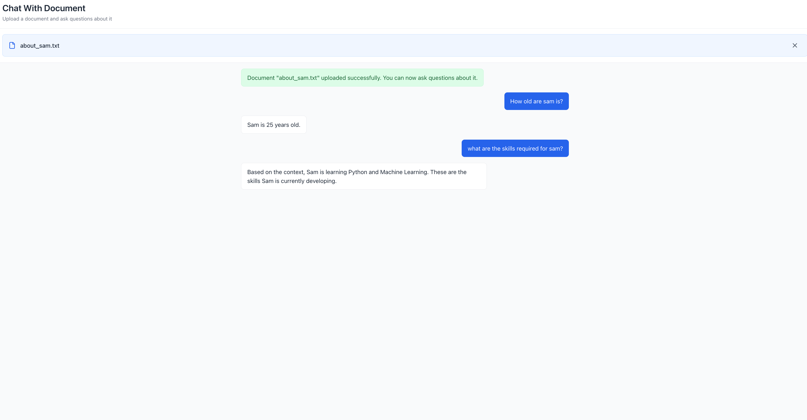

# Intelligent RAG System

An intelligent Retrieval-Augmented Generation (RAG) system built with FastAPI backend and React frontend. This system allows users to upload documents (PDF, TXT, MD), process them into chunks, generate embeddings, store them in a vector database, and query them via a chat interface for intelligent responses.

## Features

- **Document Upload**: Support for PDF, TXT, and MD files.
- **Text Processing**: Automatic chunking and embedding generation.
- **Vector Storage**: PostgreSQL with pgvector for efficient similarity search.
- **Chat Interface**: Interactive querying with AI-generated answers using Google's Gemini.
- **Asynchronous Processing**: Non-blocking operations for better performance.

## Project Structure

```
IntelligentRagSystem/
├── README.md
├── backend/
│   ├── main.py                 # FastAPI app entry point
│   ├── init_db.py              # Database initialization script
│   ├── pyproject.toml          # Python dependencies
│   ├── app/
│   │   ├── __init__.py
│   │   ├── config.py           # Configuration settings
│   │   ├── database.py         # Database connection
│   │   ├── main.py             # App initialization
│   │   ├── models/             # SQLAlchemy models
│   │   ├── routers/            # API endpoints
│   │   ├── schemas/            # Pydantic schemas
│   │   └── utils/              # Utility functions
│   └── my_env/                 # Virtual environment (created locally)
├── frontend/
    ├── package.json        # Node.js dependencies
    ├── public/             # Static assets
    └── src/               # React source code
```

## Backend

The backend is built with FastAPI and uses PostgreSQL with pgvector for vector storage. It leverages LangChain for text splitting, Sentence Transformers for embeddings, and Google's Gemini for answer generation.

### Prerequisites

- Python 3.13 or higher
- PostgreSQL with pgvector extension
- Google Gemini API key (get from [Google AI Studio])

### Installation

1. **Clone the repository:**
   ```bash
   git clone <repository-url>
   cd IntelligentRagSystem
   ```

2. **Set up the backend:**
   ```bash
   cd backend
   python -m venv my_env  # Create virtual environment (if not present)
   source my_env/bin/activate  # Activate (on Windows: my_env\Scripts\activate)
   poetry install   # Install dependencies
   ```

3. **Environment Setup:**
    
    Rename a `.env.example` file to a `.env` file in the `backend/` and update the below   credentials accordingly
     ```
    - DB_USERNAME= YOUR_USERNAME
    - DB_PASSWORD= YOUR_PASSWORD
    - DB_HOST= localhost
    - DB_PORT= 5432
    - DB_NAME= YOUR_DATABASE_NAME
    - GEMINI_API_KEY= YOUR_GEMINI_KEY
    - EMBEDDING_MODEL = YOUR_EMBEDDING_MODEL
    ```


5. **Run the server:**
   ```bash
   uvicorn main:app --reload
   ```
   The API will be available at `http://localhost:8000`.
   - API documentation: `http://localhost:8000/docs` (Swagger UI).

### Technical Details

#### Chunks
Text documents are split into overlapping chunks using LangChain's `RecursiveCharacterTextSplitter`:
- Chunk size: 900 characters
- Chunk overlap: 180 characters
- Separators: `["\n\n", "\n", " ", ""]`

#### Embeddings
Embeddings are generated using the `all-MiniLM-L6-v2` model from Sentence Transformers:
- 384-dimensional vectors
- Normalized for cosine similarity
- Asynchronous processing

#### Storage
- **Document Table**: Metadata (file_name, file_type, content)
- **DocumentChunk Table**: Chunks with embeddings and references
- Vector search uses cosine distance

#### Chat Workflow
1. Query embedding
2. Retrieve top-k similar chunks (k=5)
3. Assemble context
4. Generate answer with Gemini 2.5-flash
5. Return response

**API Endpoints:**
- `POST /api/upload`: Upload documents
- `POST /api/chat`: Query with questions

## Frontend

The frontend is a React application providing a user interface for document upload and chat interaction.

### Prerequisites

- Node.js 16 or higher
- npm or yarn

### Installation

1. **Navigate to frontend:**
   ```bash
   cd frontend
   ```

2. **Install dependencies:**
   ```bash
   npm install
   ```

3. **Start the development server:**
   ```bash
   npm start
   ```
   The app will be available at `http://localhost:3000`.

### Features

- Document upload (PDF, TXT, MD)
- Chat interface for querying
- Responsive design with Tailwind CSS

## Usage

1. Start the backend server (`uvicorn main:app --reload`).
2. Start the frontend (`npm start` in `frontend`).
3. Upload documents via the frontend.
4. Ask questions in the chat interface.

## Snapshots

Here are some screenshots of the Intelligent RAG System in action:

### Document Upload and Chat Interface

*Upload documents (PDF, TXT, MD) to process and index them.*

### Result of Chat Message After uploading pdf


### Result of Chat Message After uploading text file



